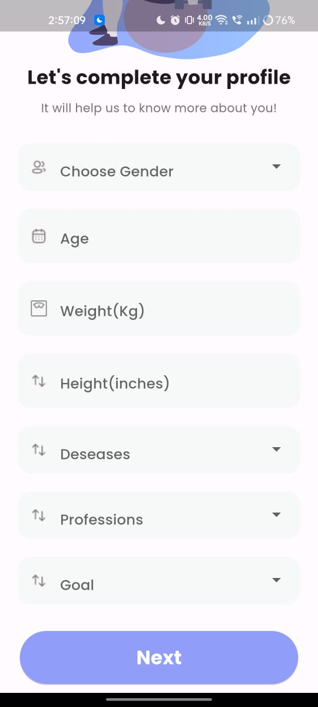

# LivewithYog

Welcome to LivewithYog, your personalized yoga companion designed to elevate your well-being and promote holistic wellness. Whether you're just beginning your yoga journey or seeking mastery, LivewithYog caters to your unique needs and aspirations. By seamlessly blending ancient wisdom with modern technology, we empower you to discover the transformative power of yoga, personalized just for you.

## Getting Started

### Setup Instructions

Follow these steps to set up the LivewithYog app locally on your device:

1. **Clone the Repository:** Clone the LivewithYog repository from [GitHub Repository Link](#) to your local machine.

2. **Install Dependencies:**
   - Navigate to the root directory of the project.
   - Run `npm install` to install backend dependencies.
   - Navigate to the `frontend` directory.
   - Run `flutter pub get` to install frontend dependencies.

3. **Set Up Environment Variables:** Create a `.env` file in the root directory and add necessary environment variables such as database credentials, API keys, etc.

4. **Start the Backend Server:** 
   - In the root directory, run `npm start` to start the Node.js backend server.

5. **Run the Frontend:**
   - Navigate to the `frontend` directory.
   - Run `flutter run` to start the Flutter frontend application.

6. **Explore LivewithYog:** Open the LivewithYog app on your device and begin your wellness journey!

### Screenshots

## Let's Get Started

1. **Create Your Account:** Begin your journey by downloading the LivewithYog app from your preferred app store. Follow the simple on-screen instructions to create your account and start your wellness journey.

2. **Share Your Story:** Tell us about yourself. Provide insights into your age, weight, height, lifestyle, any health concerns, and your ultimate wellness goals. The more we know about you, the better we can customize your yoga experience.

3. **Explore Your Personalized Plan:** Delve into your personalized yoga plan curated just for you. Our intelligent algorithms analyze your inputs to recommend yoga routines that resonate with your aspirations and fitness level.

4. **Track Your Progress:** Monitor your progress as you embark on your yoga journey. LivewithYog offers intuitive tools to track your yoga sessions, calories burned, and overall well-being. Witness your growth and transformation unfold with every practice.

5. **Join Our Community:** Engage with a vibrant community of like-minded individuals. Share your experiences, seek advice, and inspire others on their wellness journey. Together, we create a supportive environment where everyone thrives.

Ready to embark on a transformative journey with LivewithYog? Let's take the first step towards holistic well-being together. Download the LivewithYog app now and embrace the endless possibilities of your yoga journey!

## Tech Stack:

* 
* 
* 
* 
* 
* 
* 

Thank you for choosing LivewithYog as your yoga companion. Namaste! 🧘‍♂️🌿

